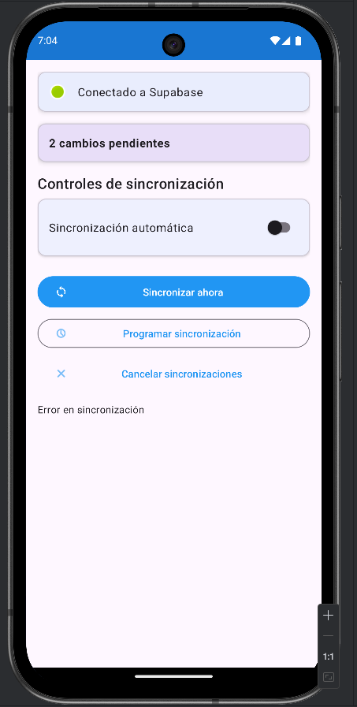

# App Médica Android – Documentación y Entregables

[](https://github.com/Thebyren/MedicalApp/issues)
[](https://github.com/Thebyren/MedicalApp/network)
[](https://github.com/Thebyren/MedicalApp/stargazers)
[](https://github.com/Thebyren/MedicalApp/blob/main/LICENSE)
[](https://github.com/Thebyren/MedicalApp/graphs/contributors)

Este repositorio contiene el código de la aplicación Android y todos los entregables solicitados.

## Entregables requeridos

- **[video demo](https://youtu.be/LuXUjP487sI)**
- **[flujo.json](docs/My%20workflow.json)**
- **[Documento de Propuesta](docs/propuesta.pdf)**

---

## 1) Video de la Fase 1

- **Enlace al video**: PENDIENTE → reemplaza este enlace por el de tu presentación inicial de la app.
  - URL: https://example.com/tu-video-fase-1
  - Asegúrate de que el enlace sea público o accesible para revisión.

---

## 2) Repositorio de GitHub

### Descripción del proyecto

Aplicación médica para gestión de pacientes y citas, con sincronización bidireccional entre base de datos local (Room) y backend en la nube (Supabase). Incluye sincronización en background con WorkManager, interfaz para disparar sincronización manual y persistencia confiable con metadatos de sync.

### Principales características

- **Gestión de pacientes y citas** con formularios completos.
- **Lista de pacientes** paginada y ordenada por creación (id DESC).
- **Sincronización bidireccional Room ↔ Supabase** con tabla `sync_metadata`.
- **Sync en background** cada hora usando `WorkManager` y worker dedicado.
- **UI de sincronización manual** (fragmento/ajustes) y `SyncViewModel`.

#### Funcionalidades clínicas 

- **Registro de pacientes** con datos clave y campos básicos.
- **Citas**: creación/edición y agenda.
- **Recetas**: emisión y registro.
- **Necesidades del paciente** y notas clínicas.
- **Multi-gestión de doctores** y asignaciones.
- **Configuraciones básicas** de la aplicación.

### Arquitectura de sincronización (resumen)

- **SyncMetadata**: tabla para rastrear estado de sincronización por registro.
- **SyncRepository**: orquesta lectura/escritura y resolución de conflictos.
- **SyncWorker**: corre en segundo plano periódicamente.
- **Mappers y DTOs**: conversión entre entidades Room y Supabase.
- **Hilt** para inyección de dependencias, incluyendo módulo de Supabase y WorkManager.

Archivos clave (orientativo):

- `data/sync/SyncEntity.kt`
- `data/sync/dto/SupabaseDtos.kt`
- `data/sync/mapper/EntityMappers.kt`
- `data/entities/SyncMetadata.kt`
- `data/dao/SyncMetadataDao.kt`
- `data/repository/SyncRepository.kt`
- `sync/SyncWorker.kt`
- `viewmodel/SyncViewModel.kt`
- `ui/settings/SyncFragment.kt` + `fragment_sync.xml`
- `di/SupabaseModule.kt` y `di/WorkManagerModule.kt`

### Requisitos y dependencias

- **Android Studio** (versión actual recomendada)
- **Kotlin**
- **Room** para base de datos local
- **Hilt** para DI
- **WorkManager** para tareas en background
- **Supabase** (Postgrest, Realtime) + **Ktor Client**
- **Google Gemini (PaLM/Gemini API)** para reportes inteligentes
- Compatibles con las configuraciones en `build.gradle.kts` y `gradle.properties`

### Variables y configuración

En `local.properties` (no se sube a git), define:

```
GEMINI_API_KEY=TU_API_KEY_DE_GEMINI
SUPABASE_URL=TU_URL
SUPABASE_ANON_KEY=TU_KEY
```

Consulta `local.properties.example` como referencia.

### Reportes inteligentes con Gemini

- La app genera **reportes inteligentes** a partir de los datos almacenados en **Room** (consultas, resúmenes y respuestas en lenguaje natural).
- Requiere configurar `GEMINI_API_KEY` en `local.properties` (ver ejemplo en `local.properties.example`).
- Uso típico:
  - Se construyen prompts con el contexto de los datos (agregados/consultas) y se llama a la API de Gemini para producir un reporte claro.
  - Los resultados se muestran en la UI en formato de texto amigable.
- Privacidad: no coloques claves ni datos sensibles en el repositorio; usa `local.properties` y/o variables seguras.

### Instalación y ejecución

1. Clona el repositorio y abre en Android Studio.
2. Copia `local.properties.example` a `local.properties` y configura `GEMINI_API_KEY`, `SUPABASE_URL` y `SUPABASE_ANON_KEY`.
3. Sincroniza Gradle y compila.
4. Ejecuta la app en un dispositivo/emulador.

### Migraciones y base de datos

- DB version actual: 7 (incluye `sync_metadata` y `usuarioId` nullable en `Paciente`).
- Migraciones implementadas: `MIGRATION_5_6` (sync_metadata) y `MIGRATION_6_7` (ajuste de `usuarioId`).

### Capturas de pantalla / GIFs
<div style="display:flex; max-height: 400px; width:100%; aspect-ratio: 1/1; overflow: auto;">



</div>


### Estructura del repositorio (resumen)

```
app/
  src/
    main/
      java/...         # código fuente
      res/...          # recursos Android
docs/
  PROPOSAL.md          # propuesta del proyecto (actualizada)
  README-assets/       # capturas de pantalla
n8n/
  flows/
    README.md          # instrucciones para exportar/importar
    My workFlow.json.json     # PENDIENTE: coloca aquí tu export .json
```

---

## 3) Flujo de n8n

- Exporta tu(s) flujo(s) desde n8n y coloca el archivo en `n8n/flows/` (por ejemplo `My workFlow.json.json`).
- Alternativamente, proporciona un enlace de descarga accesible y colócalo aquí:
  - Enlace al flujo: [flujo de trabajo](docs/My%20workflow.json)

### Explicación de la integración con n8n

- La app puede interoperar con procesos automatizados mediante n8n. Ejemplos comunes:
  - Webhook que recibe eventos de la app (altas/actualizaciones) y los enruta a otros servicios.
  - Job programado que consulta Supabase y envía notificaciones o correos.
  - Transformaciones/ETL de datos entre Supabase y terceros.
- Incluye en `n8n/flows/README.md` las credenciales/variables de entorno esperadas por el flujo y pasos para importarlo.


### Flujo n8n para WhatsApp (demo incluido)

- Archivo JSON provisto: `docs/My workflow.json` (demo). En este demo se sustituyó la entrada real de WhatsApp por un trigger de chat de prueba, pero el flujo lógico es el mismo.
- Diagrama lógico del flujo:
  - **Entrada (WhatsApp webhook o Chat Trigger de prueba)** → `AI Agent` (Gemini) genera SQL a partir de la pregunta del usuario usando el esquema de la BD.
  - `Code in JavaScript` limpia el bloque de código (remueve ```sql ... ```).
  - `Execute a SQL query` ejecuta la consulta en **Postgres** (ej. Supabase).
  - `AI Agent1` formatea una respuesta en lenguaje natural basada en el JSON resultante.
  - (Producción) Enviar la respuesta al canal de WhatsApp. (En el demo se queda en n8n.)
- Nodos clave en el JSON:
  - `@n8n/n8n-nodes-langchain.chatTrigger` (demo) → reemplazar por webhook de WhatsApp en producción (Twilio WhatsApp, WhatsApp Business API o el conector que uses).
  - `@n8n/n8n-nodes-langchain.agent` + `lmChatGoogleGemini` → LLM que genera SQL con reglas (uso de unaccent/ILIKE, joins, fechas, etc.).
  - `n8n-nodes-base.code` → limpieza de la salida SQL.
  - `n8n-nodes-base.postgres` → ejecución de SQL en tu instancia Postgres (Supabase recomendado).
  - `@n8n/n8n-nodes-langchain.memoryPostgresChat` → memoria de chat en Postgres (opcional).
- Credenciales/variables requeridas en n8n (ejemplo):
  - `Postgres account` → host, puerto, DB, usuario y contraseña (para Supabase, usar los datos de conexión de la instancia).
  - `Google Gemini(PaLM) Api account` → clave de API para Gemini.
  - (WhatsApp en producción) Credenciales del proveedor (Twilio/Meta), y URL pública para el webhook.
- Ubicación del demo: `docs/My workflow.json`. Si prefieres, muévelo a `n8n/flows/My workFlow.json.json` para estandarizar.

---

## 4) Documento de Propuesta

- El documento inicial de propuesta se incluye/actualiza en `docs/PROPOSAL.md`.
- Si hubo cambios significativos respecto a la propuesta original, actualiza las secciones correspondientes y agrega un apartado de cambios.

---

## Guía rápida de contribución

- Usa ramas descriptivas y Pull Requests.
- Mantén las migraciones de Room consistentes con cambios de entidades.
- Añade capturas actualizadas cuando agregues nuevas pantallas o flujos clave.

## Licencia

MIT License

Copyright (c) 2025

Permission is hereby granted, free of charge, to any person obtaining a copy
of this software and associated documentation files (the "Software"), to deal
in the Software without restriction, including without limitation the rights
to use, copy, modify, merge, publish, distribute, sublicense, and/or sell
copies of the Software, and to permit persons to whom the Software is
furnished to do so, subject to the following conditions:

The above copyright notice and this permission notice shall be included in all
copies or substantial portions of the Software.

THE SOFTWARE IS PROVIDED "AS IS", WITHOUT WARRANTY OF ANY KIND, EXPRESS OR
IMPLIED, INCLUDING BUT NOT LIMITED TO THE WARRANTIES OF MERCHANTABILITY,
FITNESS FOR A PARTICULAR PURPOSE AND NONINFRINGEMENT. IN NO EVENT SHALL THE
AUTHORS OR COPYRIGHT HOLDERS BE LIABLE FOR ANY CLAIM, DAMAGES OR OTHER
LIABILITY, WHETHER IN AN ACTION OF CONTRACT, TORT OR OTHERWISE, ARISING FROM,
OUT OF OR IN CONNECTION WITH THE SOFTWARE OR THE USE OR OTHER DEALINGS IN THE
SOFTWARE.


